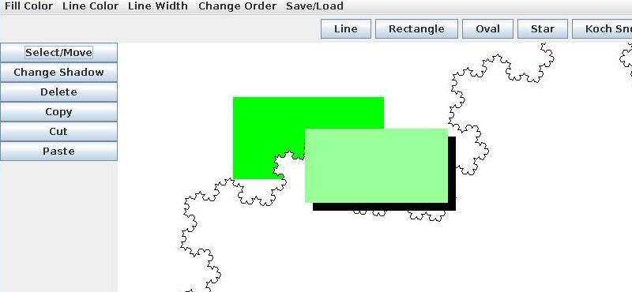

# Kikagaku Penki

Kikagaku Penki is a simple graphics editor.




## Features
Kikagaku Penki:
- supports the creation of geometrical figures such as lines, rectangles and Koch snowflakes.
- supports multi-layered editing.
- allows user to save his/her work in a file and load it at a later time.

## Installation
To install Kikagaku Penki, first clone this repository:
```sh
git clone https://github.com/farleyoli/kikagaku-penki
```

Compile the program with `javac`:
```sh
cd src
javac *.java
```

Finally, run the program:
```sh
java MyApp
```
